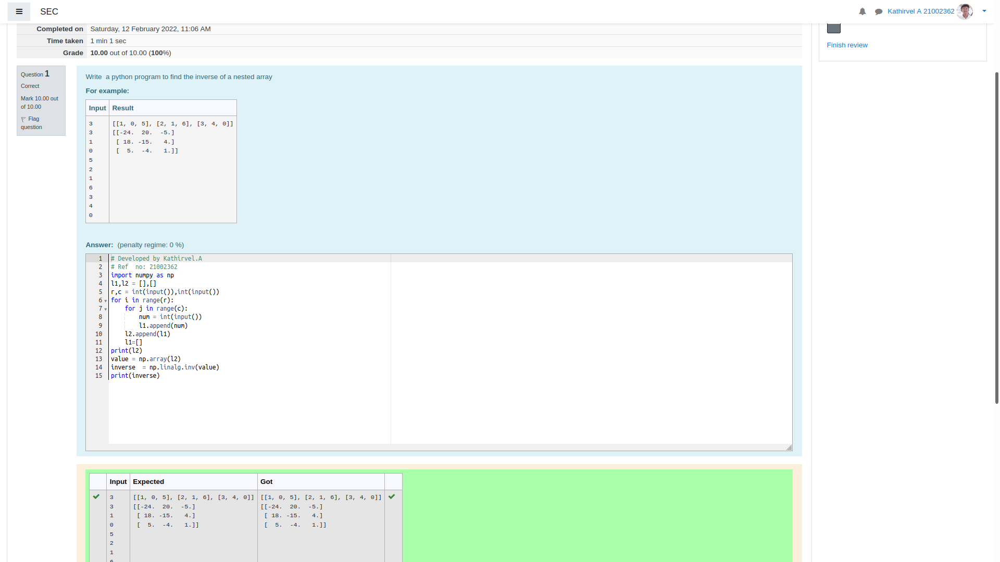

# Inverse-of-matrix

## AIM:

## ALGORITHM:
### Step 1:

Use import as np.
### Step 2:

Enter the input.
### Step 3:

Use for loop and range.
### Step 4:

Use np.linalg.inv() to find inver of a matrix.
### Step 5:

Print()

## PROGRAM:
~~~
# Developed by Kathirvel.A
# Ref  no: 21002362

import numpy as np
l1,l2 = [],[]
r,c = int(input()),int(input())
for i in range(r):
    for j in range(c):
        num = int(input())
        l1.append(num)
    l2.append(l1)
    l1=[]
print(l2)
value = np.array(l2)
inverse  = np.linalg.inv(value)
print(inverse)
~~~

## OUTPUT:

## RESULT:
Thus the program is written to find the matrix.
